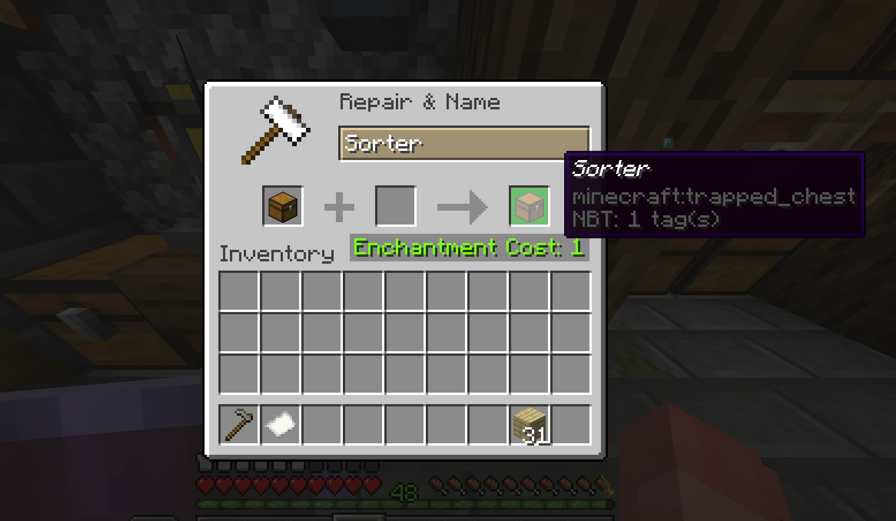
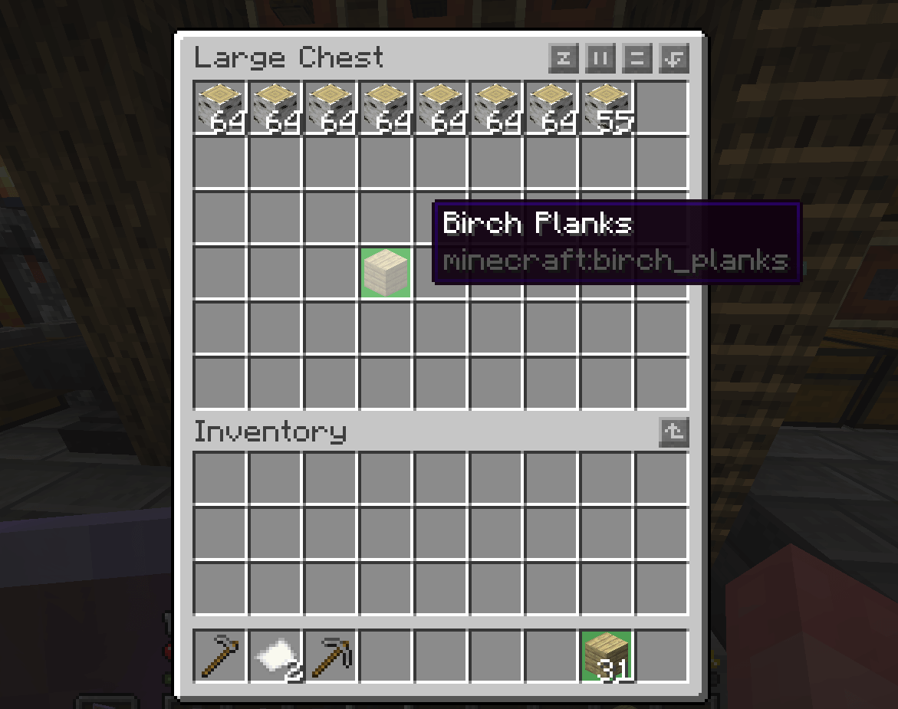
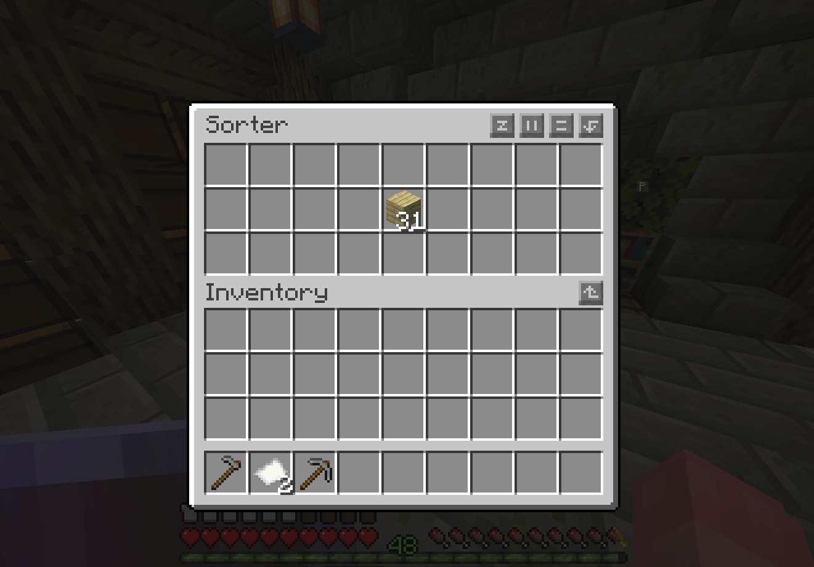
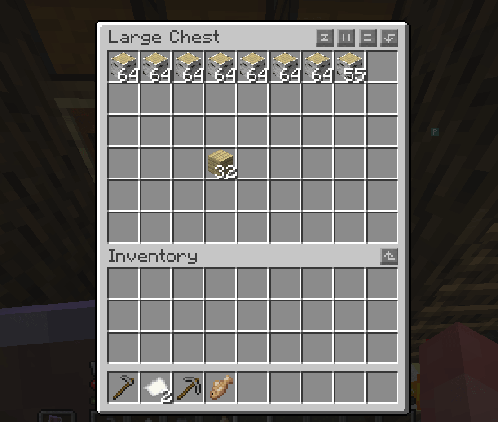

# VanillaSort

Classic chest sorted, no fancy stuff, plain basic.

[Read the description](DESCRIPTION.md)

## Usage

> Create a **Trapped Chest**

> Name the chest `Sorter` in the anvil

Now put a wooden log in a barrel, when the trapped chest closes, the items get sent to the appropriate chest.

## Create a Sorter Trapped Chest

  

## Put a block in a chest or barrel

  

## Put items in the sorter chest

  

## The items get sent to the appropriate chest

  

